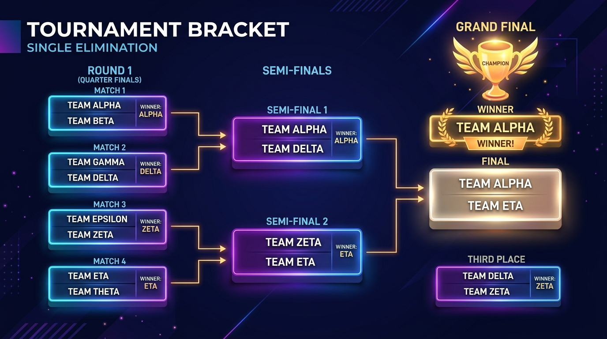
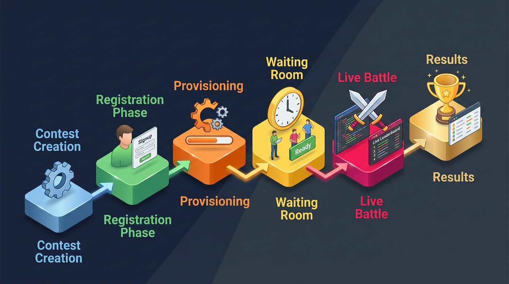

# CCW Contest System — A Complete Guide (Part 1 of 2)

The Coding Club Website (CCW) at IIT Guwahati has a full-blown custom contest system built in, where students can challenge each other to real-time coding duels. Think of it like your own private Codeforces arena — but with 1v1 duels, team battles, bracket tournaments, and live scoreboards, all running inside the browser.

This two-part blog covers everything about the contest system. In this first part, we'll walk through what you can do as a user — all the contest formats, how problems are picked, how registration works, the full contest flow from creation to results, tiebreaker rules, reconnection handling, and the do's and don'ts.

In [Part 2](02-contest-architecture-under-the-hood.md), we go under the hood into the technical architecture — how BullMQ, Redis, and Server-Sent Events power all of this in real-time.

---

## Table of Contents
1. [Contest Formats](#contest-formats)
2. [Contest Modes — Blitz vs Arena](#contest-modes--blitz-vs-arena)
3. [How Problems Are Selected](#how-problems-are-selected)
4. [Registration](#registration)
5. [The Full Contest Lifecycle](#the-full-contest-lifecycle)
6. [Tiebreaker Criteria](#tiebreaker-criteria)
7. [What Happens If You Disconnect?](#what-happens-if-you-disconnect)
8. [Bracket Tournaments — The Full Breakdown](#bracket-tournaments--the-full-breakdown)
9. [Do's and Don'ts](#dos-and-donts)
10. [Screenshots](#screenshots)

---

## Contest Formats

There are four contest formats, each with a completely different vibe:

### 1. 1v1 (Head-to-Head Duel)
The classic showdown. Two players face off directly.
* **Team size:** 1
* **Vibe:** Quick, personal, intense. Perfect for settling a debate over who writes cleaner code.

### 2. Solo Tournament (Free-for-All)
A chaotic brawl where multiple individual players compete simultaneously.
* **Team size:** 1
* **Vibe:** Everyone for themselves. The leaderboard shifts constantly.

### 3. Team Tournament
Gather your friends and tackle problems as a squad.
* **Team size:** Enforced at exactly **3 members**.
* **Vibe:** Requires coordination during registration — all members must register with the exact same team name. The system groups matching names together and validates team sizes at the deadline. Incomplete teams get dropped.

### 4. Bracket (Elimination Tournament)
The ultimate test of endurance. A single-elimination bracket tree where winners advance to the next round.
* **Capacity:** Supports any number of participants. If the count isn't a perfect power of 2, the system automatically pads with "bye" slots (free passes).
* **Seeding:** Uses **snake seeding** based on Codeforces ratings to ensure the strongest competitors don't meet until later rounds. Manual seeding is also available.
* **Rounds:** Automatically generates Quarter-Finals → Semi-Finals → Finals (and any earlier rounds needed).
* **Third-place playoff:** Optional — can be toggled on during creation.
* **Visualization:** The bracket tree is rendered as an interactive, zoomable diagram using React Flow.

---

## Contest Modes — Blitz vs Arena

Once you're in a match, the *way* problems are presented completely changes the strategy. Every contest runs in one of two modes:

### ⚡ Blitz Mode
Fast-paced, speedrun-style competition.
* Problems are revealed **one at a time**, sequentially.
* You **must** solve the current problem before the system reveals the next one.
* The system tracks a `currentProblemIndex` so everyone in the room is on the same problem.
* Feels like a race — pure speed matters.

### 🏟️ Arena Mode
The traditional competitive programming feel.
* **All problems** are revealed at once as soon as the match starts.
* Solve them in **any order** you want.
* **Strategy is key:** Do you knock out the easy ones quickly to build momentum, or go straight for the high-value problems?

---

## How Problems Are Selected

Fair problem selection is critical. If someone has already solved a problem before, it's not fair to include it. Here's how we handle this:

### Bulk (Automatic)
The default mode. The system randomly picks *N* problems from its Codeforces problem database, filtered by a rating range (e.g., 800–1200).

> [!IMPORTANT]
> **The Golden Rule:** The system **excludes** problems already solved by **ANY** registered participant.
>
> Right before the contest starts, it pulls the latest submission data from the Codeforces API for every registered user, builds a combined list of all problems they've ever solved, and strictly filters those out of the selection pool.

* Selected problems are sorted by difficulty (ascending — easiest first).
* Points are calculated automatically: **Points = Rating ÷ 10** (so a 1200-rated problem is worth 120 points).

### Fine-Tuned (Manual)
For carefully curated contests where the organizer wants full control.
* The contest creator specifies exact Codeforces problem IDs.
* In bracket tournaments, specific problems can be assigned to specific rounds, letting you control the difficulty curve as the tournament progresses.

### Test Mode
Used exclusively for development and debugging. It uses hardcoded simple problems (Watermelon, Theatre Square, Next Round) so developers don't have to rack their brains while testing the plumbing.

---

## Registration

Before the coding starts, participants need to register. The system supports:

* **Open** registration — anyone with a linked Codeforces handle can join.
* **Closed** registration — invite-only.
* **Registration window** — configurable start time and deadline.
* **Participant cap** — maximum number of players can be enforced.
* **Team formation** — for team tournaments, each user registers with a team name. Users with the same team name are grouped together automatically.

> [!WARNING]
> If your team isn't complete (i.e., fewer than 3 members for a team tournament) when the deadline hits, the **entire contest** may get cancelled due to insufficient valid teams.

---

## The Full Contest Lifecycle

Here's exactly what happens from the moment someone clicks "Create Contest" to when a winner is crowned.

### Phase 1: Creation 📝
* A coordinator creates the contest using a creation modal.
* They configure: name, description, format, mode, problem selection method, duration, and registration window.
* Contest presets can be used for quick setup (e.g., "Quick 1v1 Blitz").
* **Status:** `draft`

### Phase 2: Registration 🎟️
* Status transitions to `registration` (immediately or at a scheduled time).
* Users register using their linked Codeforces handle (and specify a team name if applicable).
* The listing page shows registration count and a live countdown to the deadline.
* **Status:** `registration`

### Phase 3: Provisioning ⚙️
*Triggered automatically when the registration deadline passes.*
* A background job (`check_start`) fires up.
* **Validation:** Ensures at least 2 valid teams exist and all team sizes are correct. If not — contest cancelled, creator notified.
* **Problem generation (Bulk):** Fetches the latest Codeforces submissions for all users, builds the exclusion set, and picks fresh unseen problems.
* **Room setup:** Creates a `ContestRoom`, `ContestProblemSet`, and `ContestTeam` documents in the database.
* **State initialization:** Sets up all real-time state in Redis — room status, team memberships, problem list, score counters.
* Schedules the waiting room to open at the configured start time.
* **Status:** `provisioning`

### Phase 4: Waiting Room ⏳
* The waiting room opens a few seconds before the scheduled start time (to avoid race conditions).
* Users see a **"Ready Up"** button.
* A real-time event broadcasts the room state to all connected clients.
* **Timeouts:**
  * Each individual team has **60 seconds** to click Ready.
  * The overall room has a **5-minute** grace period.
* If a team doesn't ready up, they are **withdrawn** from the room.
* **Special bracket rule:** In bracket tournaments, the match **force-starts** even if not all players are ready. The tournament must go on!

### Phase 5: Live Battle ⚔️
* Problems are revealed based on the mode:
  * **Blitz:** First problem only. Next revealed after solving.
  * **Arena:** All problems at once.
* Users write code and **submit directly on Codeforces** (not on CCW).
* A background worker continuously polls the Codeforces API for new submissions.
* **When an Accepted (AC) submission is detected:**
  1. An atomic script locks the problem for the solving team.
  2. It compares Codeforces timestamps — if another team actually solved it seconds earlier (due to API polling delays), the lock is corrected and given to the rightful first solver.
  3. Scores are updated instantly.
  4. A real-time event fires to update all connected clients' scoreboards.
* Match timer counts down throughout.
* **Status:** `active`

### Phase 6: Results 🏆
* The room ends via one of three triggers:
  * ⏱️ **Timeout** — the match timer runs out.
  * ✅ **All problems solved** — every problem in the set has been claimed.
  * 🏳️ **Forfeit** — a player disconnects for too long.
* The system determines the exact winner using the tiebreaker criteria below.
* Final scores are saved permanently to the database.
* All submission records are written from the in-memory log to permanent storage.
* Redis state is cleaned up.
* For bracket tournaments: the winner is advanced to the next round, triggering new match generation.
* **Status:** `completed`

---

## Tiebreaker Criteria

When scores are tied, we need a bulletproof way to determine the winner. Here is the exact order of operations:

| Priority | Criteria | Explanation |
| :--- | :--- | :--- |
| **1** | **Highest Total Score** | More problems solved = higher score. The primary metric. |
| **2 (Arena)** | **Lowest Penalty Time** → then **Lowest Last Solve Time** | Traditional ICPC-style tiebreaker. Faster overall = better. |
| **2 (Blitz)** | **Lowest Total Solve Time** → then **Fewest Wrong Submissions** | Speed and accuracy. |
| **3** | **Lowest Average CF Rating** | The underdog rule! If everything else is tied, the lower-rated team wins. Rewards upsets. |
| **4** | **Lexicographic Team ID** | Absolute last resort fallback so the system never deadlocks. |

---

## What Happens If You Disconnect?

Internet dropped in the middle of a duel? Here's what happens:

> [!TIP]
> **Redis is the source of truth.** All active room state lives in Redis. When you reconnect, the page fetches the current state from the server and re-subscribes to the real-time event stream. You receive a full state sync and pick up right where you left off. **Zero data loss.**

**But don't stay gone too long.**

Your online status is tracked using a presence key in Redis. If you're offline for too long mid-match, a disconnect timeout fires. Your team is **automatically forfeited**, and the opponent wins by default.

---

## Bracket Tournaments — The Full Breakdown

The Bracket format has its own specialized engine running on top of the standard contest lifecycle.

1. **Seeding:** After registration closes, the system uses **snake seeding** based on Codeforces ratings. Seed 1 faces Seed N, Seed 2 faces Seed N-1, and so on. This ensures the strongest competitors don't eliminate each other in early rounds.

2. **Padding:** The participant count is padded to the next power of 2 using "bye" slots. For example, 6 participants become 8, with 2 teams getting a free pass to round 2.

3. **Round generation:** Rooms, teams, and problem sets are created for each match in the round.

4. **Advancement:** When a match finishes, `advanceWinner()` moves the winning team to the next round's bracket slot.

5. **Round completion:** `checkRoundCompletion()` waits for ALL matches in a round to finish before triggering the next round's room generation.

6. **Live bracket updates:** Contest-level real-time events broadcast bracket progression to all viewers — even spectators not in a match can watch the bracket fill in live.

7. **Force-start:** If a player doesn't click Ready in a bracket match, the match starts anyway. You can't hold up a tournament.

---

## Do's and Don'ts

| ✅ Do | ❌ Don't |
| :--- | :--- |
| Verify your Codeforces handle is linked before registering. | Close your browser during an active match — you might get forfeited! |
| Click Ready within 60 seconds of the waiting room opening. | Submit from a different, unlinked Codeforces account — we won't see it. |
| Submit solutions on **Codeforces** — the system polls from there. | Assume previously solved problems will appear — the system excludes them. |
| Coordinate your exact team name with teammates for team tournaments. | Register for a team tournament if your team isn't complete by the deadline. |
| Keep your browser tab open for live score updates. | Panic if you briefly disconnect — reconnection picks up your state. |

---

## Screenshots — Full UI Showcase

Here's a visual walkthrough of every screen in the contest system:

---

**Next up → [Part 2: Under the Hood — How BullMQ, Redis & SSE Power the Contest System](02-contest-architecture-under-the-hood.md)**

We'll break down the technical architecture — the background job queues, the Redis data model, the atomic Lua scripts, and the real-time event system that makes all of this work without missing a beat.
