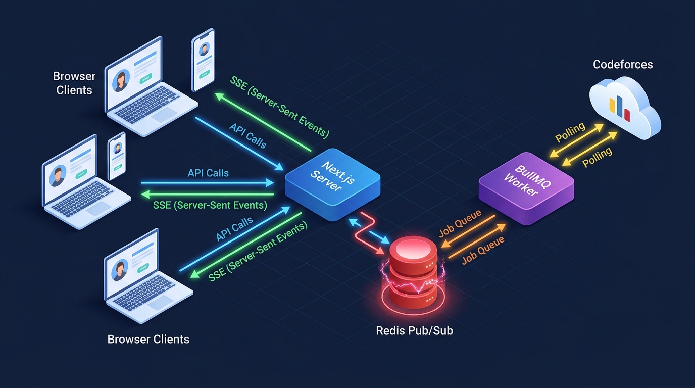

# Under the Hood — How BullMQ, Redis & SSE Power the Contest System (Part 2 of 2)

In [Part 1](01-contest-system-deep-dive.md), we walked through what the contest system looks like from a user's perspective — the formats, modes, lifecycle, and rules. Now let's look at how all of that actually works behind the scenes.

Running a live coding contest where scores update in real-time, matches start at exact times, disconnects are handled gracefully, and bracket tournaments advance automatically — that's not simple. It requires precision-timed background jobs, a real-time event system, and an in-memory data store that never drops a beat.

Here's how we built it.

---

## Table of Contents
1. [The Two-Process Architecture](#the-two-process-architecture)
2. [Why BullMQ?](#why-bullmq)
3. [The Reconciliation Queue — Contest State Machine](#the-reconciliation-queue--contest-state-machine)
4. [The CF Sync Queue — Codeforces Integration](#the-cf-sync-queue--codeforces-integration)
5. [Redis — The Real-time Contest Backbone](#redis--the-real-time-contest-backbone)
6. [Atomic Problem Locking (Lua Script)](#atomic-problem-locking-lua-script)
7. [SSE — Real-time Score Updates](#sse--real-time-score-updates)
8. [How the Frontend Talks to the Backend](#how-the-frontend-talks-to-the-backend)

---

## The Two-Process Architecture

The contest system can't run on a single web server alone. Imagine the web server is busy polling the Codeforces API for a live match — it can't respond to users clicking "Ready" at the same time. So the app runs as **two separate processes**:

1. **`ccw-web`** — the Next.js web server. Handles all HTTP requests, serves pages, runs API routes, and keeps SSE (real-time event) connections open.
2. **`ccw-worker`** — the background worker. Processes BullMQ jobs — starting rooms, polling Codeforces, reconciling scores, advancing bracket winners.

Both processes connect to the same Redis and MongoDB. Think of `ccw-web` as the front-of-house staff taking orders, and `ccw-worker` as the kitchen doing the cooking. They work on different things, but they share the same pantry.

In production, both are managed by **PM2** so they auto-restart if they crash. During development, they run side by side using `concurrently`.


---

## Why BullMQ?

The contest lifecycle is full of "do this thing at exactly this time" requirements:
- "Open the waiting room in exactly 45 seconds."
- "If nobody clicks Ready in 5 minutes, cancel the match."
- "When the 30-minute timer runs out, end the room and calculate scores."

You can't use `setTimeout` for this — if the server restarts, you lose the timer. You need something **persistent** and **reliable**.

**BullMQ** is a Redis-backed job queue that gives us:
- **Delayed execution:** Schedule a job to fire in exactly N milliseconds.
- **Retry with exponential backoff:** If the Codeforces API is down, try again in 2s, then 4s, then 8s.
- **Atomic processing:** Only one worker picks up each job — no duplicates.
- **Unique job IDs:** Prevents the same job from being queued twice (e.g., `ready-timeout-{roomId}`).

Think of BullMQ like an ultra-reliable alarm clock. You set it, and it **will** go off at the right time, even if the power flickers.


---

## The Reconciliation Queue — Contest State Machine

The `reconciliation_queue` is the **brain** of the contest system. It's a single BullMQ queue that acts as a state machine, pushing contests through their lifecycle with precisely-timed jobs.

> [!IMPORTANT]
> This worker runs with **concurrency: 1** — only one job is processed at a time. This prevents race conditions where two jobs might try to modify the same room simultaneously. The lock duration is extended to **10 minutes** to account for long Codeforces API polling loops.

Here is every job type it handles:

| Job Name | When It Fires | What It Does |
|---|---|---|
| `start_registration` | Scheduled registration open time | Transitions contest from `draft` → `registration` |
| `check_start` | Registration deadline passes | Validates teams, syncs CF data, picks problems, creates rooms, schedules waiting room |
| `activate_bracket` | 5 seconds before start time | Marks bracket contest as `active` in Redis |
| `start_waiting_room` | Configured start time (minus a small buffer) | Opens the room, enables the Ready button, starts team timeouts |
| `team_ready_timeout` | 60s after waiting room opens | Withdraws a specific team if they haven't clicked Ready |
| `ready_timeout` | 5 minutes after waiting room opens | Cancels non-bracket contests if not ready, **force-starts** brackets |
| `room_timeout` | Contest duration expires | Ends the match, triggers score reconciliation |
| `room_completed` | All problems solved naturally | Writes final scores to DB, advances bracket winners |
| `mid_match_disconnect_timeout` | Player disconnects too long | Forfeits the disconnected player's team |

Every job gets:
- **3 retry attempts** with exponential backoff (2s base)
- A **unique `jobId`** to prevent duplicates (e.g., `timeout-{roomId}`)
- A precise **`delay`** in milliseconds

### How The Jobs Chain Together

Here's the key insight — these jobs form a **chain**. Each job, when it finishes, schedules the next one:

```
create_contest → start_registration (delayed)
                     ↓
               check_start (at deadline)
                     ↓
            start_waiting_room (at start time)
               ↓              ↓
    team_ready_timeout    ready_timeout (5 min)
               ↓              ↓
         [match starts]  →  room_timeout (at duration end)
                              ↓
                        room_completed
                              ↓
                    [bracket: advance winner]
```

This chain-reaction pattern means the system is fully autonomous once a contest is created. No human intervention needed — the jobs handle every transition.

---

## The CF Sync Queue — Codeforces Integration

The `cf_sync_queue` is the second BullMQ queue. Its job is keeping the Codeforces problem database fresh and polling for live submissions during matches.

- **Nightly full sync** at 2 AM — fetches all Codeforces problems and stores them in the `ContestQuestion` collection. This powers the "Bulk" problem selection mode.
- **First-run ingest** — if the database is empty, it triggers an immediate full import on startup.
- **Rate limited** — max 2 requests per second (Codeforces API is strict about this).
- **3 retries** with exponential backoff (5s base).
- **Live submission polling** — during active contests, this queue polls the Codeforces API for new accepted submissions from participants.

---

## Redis — The Real-time Contest Backbone

MongoDB stores permanent data. But during a live contest, we need **speed** — instant reads, instant writes, instant broadcasts. That's where Redis comes in.

Every active contest room has its entire state stored in Redis using multiple data structures:



| Redis Key Pattern | Data Type | What It Stores |
|---|---|---|
| `room:{roomId}:state` | Hash | Room status, mode (blitz/arena), start time, time limit, contest ID, ready count |
| `room:{roomId}:teams` | Set | All team IDs in this room |
| `room:{roomId}:scores` | Sorted Set | Team scores — sorted automatically for instant leaderboard rankings |
| `room:{roomId}:problems` | List | Problem data as JSON strings (ID, name, rating, points, reveal timestamp) |
| `room:{roomId}:penalty_time` | Sorted Set | Accumulated penalty time per team (Arena mode) |
| `room:{roomId}:last_solve` | Hash | Timestamp of the most recent solve per team |
| `room:{roomId}:solve_times` | Sorted Set | Total solve time per team (Blitz mode) |
| `room:{roomId}:wrong_subs:{teamId}` | Set | Wrong submission IDs for tracking (Blitz tiebreaker) |
| `room:{roomId}:submissions` | Stream | Full submission event log (flushed to MongoDB when room ends) |
| `room:{roomId}:ready_users` | Set | User IDs who have clicked the Ready button |
| `room:{roomId}:presence:{userId}` | Key | Presence flag — exists while user is connected |
| `team:{teamId}:meta` | Hash | Team name and current score |
| `team:{teamId}:users` | Set | User IDs belonging to this team |
| `contest:{contestId}:rooms` | Set | All room IDs for a contest (bracket tournaments have many) |
| `contest:{contestId}:meta` | Hash | Contest-level metadata (status, format) |

> [!TIP]
> **Why Redis Sorted Sets for scores?** Because Redis sorted sets maintain automatic ordering. When we update a team's score, we can instantly get the ranked leaderboard without any sorting or querying — it's O(log N). Perfect for a live scoreboard.


### Cleanup

When a room ends, **all** of its Redis keys are cleaned up. Room-scoped keys (`room:*`), team-scoped keys (`team:*`), and for non-bracket contests, contest-scoped keys (`contest:*:rooms`) are all deleted. For bracket tournaments, contest-level keys persist until the entire tournament finishes.

---

## Atomic Problem Locking (Lua Script)

Here's a tricky problem: two teams solve the same problem at nearly the same time. The background worker detects Team A's submission first (because of API polling order), awards them the points, then 2 seconds later detects Team B's submission — but Team B's Codeforces timestamp is actually **earlier**. Team B deserves the points.

We solve this with a custom **Lua script** called `claimProblem` that runs **atomically** inside Redis. "Atomically" means no other operation can interrupt it — it's like stopping time, making the decision, then resuming. No race conditions possible.

Here's the logic:

```
1. Is this problem already claimed?
   → NO  → Claim it for this team. Done. ✅
   → YES → Compare Codeforces timestamps:
           → New team solved it EARLIER? → Reclaim it. Old team loses points, new team gets them. 🔄
           → Old team was first? → Deny the claim. Too late! ❌
```

This ensures that no matter what order the API polling detects submissions, the team that actually solved it first on Codeforces **always** gets the credit. The Lua script handles the logic and the score adjustment in a single atomic operation.

---

## SSE — Real-time Score Updates

When a team solves a problem, the scoreboard needs to update instantly for everyone — not just the solver, but their opponent, spectators, and bracket viewers too. We use **Server-Sent Events (SSE)** for this.

### How It Works

> [!NOTE]
> **The SSE Flow:**
> 1. When you open a contest room page, your browser subscribes to `/api/contests/stream?roomId=X`.
> 2. The Next.js server opens a **long-lived, one-way HTTP connection** to your browser.
> 3. Under the hood, the server subscribes to a **Redis Pub/Sub channel** (`events:room:{roomId}`).
> 4. When the BullMQ worker detects a new solve, it **publishes** an event to that Redis channel.
> 5. Redis instantly broadcasts it to all subscribed Next.js server instances.
> 6. The servers push the event down the open HTTP connections to **all connected clients** at once.

This means scores update in real-time across all browsers simultaneously. No polling, no delays.


### Event Types

| Event | When It's Sent | What It Contains |
|---|---|---|
| `room.state_sync` | Room opens, user reconnects | Full room state — status, scores, problems, teams |
| `room.end` | Match finishes | Final scores, duration, end reason (timeout/forfeit/completed) |
| `team.withdrawn` | Team fails to ready up | Which team was removed and why |
| Score updates | Problem solved | Which team, which problem, new score |
| Problem reveals | Blitz: next problem unlocked | Problem data (ID, name, rating, points) |

### Three Pub/Sub Channels

Events are organized into three channels:
- **`events:room:{roomId}`** — Events for a specific match room (scores, solves, state changes).
- **`events:contest:{contestId}`** — Contest-wide events (bracket advancement, round completion). Useful for spectators watching the whole tournament.
- **`events:user:{userId}`** — User-specific events (notifications like "your contest was cancelled").

### Why SSE Instead of WebSockets?

SSE is simpler, works over standard HTTP, auto-reconnects natively, and is easier to scale behind load balancers. Since our data flow is one-directional (server → client), SSE is the perfect fit. The client sends data back via regular API calls.

---

## How the Frontend Talks to the Backend

The contest system uses two communication patterns:

### Server Actions (Direct Function Calls)
Next.js server actions let the frontend call backend functions directly — no API route needed. We use these for:

| Action | What It Does |
|---|---|
| `createRoomContest()` | Creates a new contest with all settings |
| `registerForContest()` | Registers the current user for a contest |
| `unregisterFromContest()` | Unregisters the current user |
| `getContestListing()` | Fetches all contests, categorized as active/upcoming/completed |

### API Routes (REST Endpoints)
For streaming and real-time interactions, we use traditional API routes:

| Endpoint | Method | Purpose |
|---|---|---|
| `/api/contests/stream` | GET | SSE endpoint — real-time event stream |
| `/api/contests/rooms/[roomId]/ready` | POST | Mark user as ready in the waiting room |
| `/api/contests/rooms/[roomId]/submit` | POST | Trigger submission verification |
| `/api/contests/rooms/[roomId]/state` | GET | Fetch current room state (used on page load / reconnect) |
| `/api/contests/presets` | GET | Fetch saved contest presets |
| `/api/contests/sync` | POST | Trigger manual Codeforces problem sync (admin) |

---

## Putting It All Together

Here's the full picture of how a single "problem solved" event flows through the system:

```
1. User submits solution on Codeforces.com
2. ccw-worker polls Codeforces API, detects new AC submission
3. Lua script (claimProblem) atomically locks the problem in Redis
4. Worker updates the score in Redis sorted set
5. Worker publishes SSE event to Redis Pub/Sub channel
6. ccw-web receives the event and pushes it to ALL connected browsers
7. Every browser's scoreboard updates simultaneously
8. If all problems solved → worker queues room_completed job
9. room_completed writes final data to MongoDB and cleans up Redis
10. For brackets → advanceWinner() queues the next round's rooms
```

All of this happens in **under a second** from the Codeforces submission to every browser's scoreboard updating. The combination of BullMQ for reliable job orchestration, Redis for lightning-fast state management, and SSE for real-time broadcasting makes it possible to run live coding contests that feel seamless and instant.

---

*That's a wrap on the contest system architecture! From the user-facing features in [Part 1](01-contest-system-deep-dive.md) to the technical deep-dive here, we've covered the full picture of how CCW's contest engine works — from creation to bracket finals, from background jobs to real-time scoreboards.*
